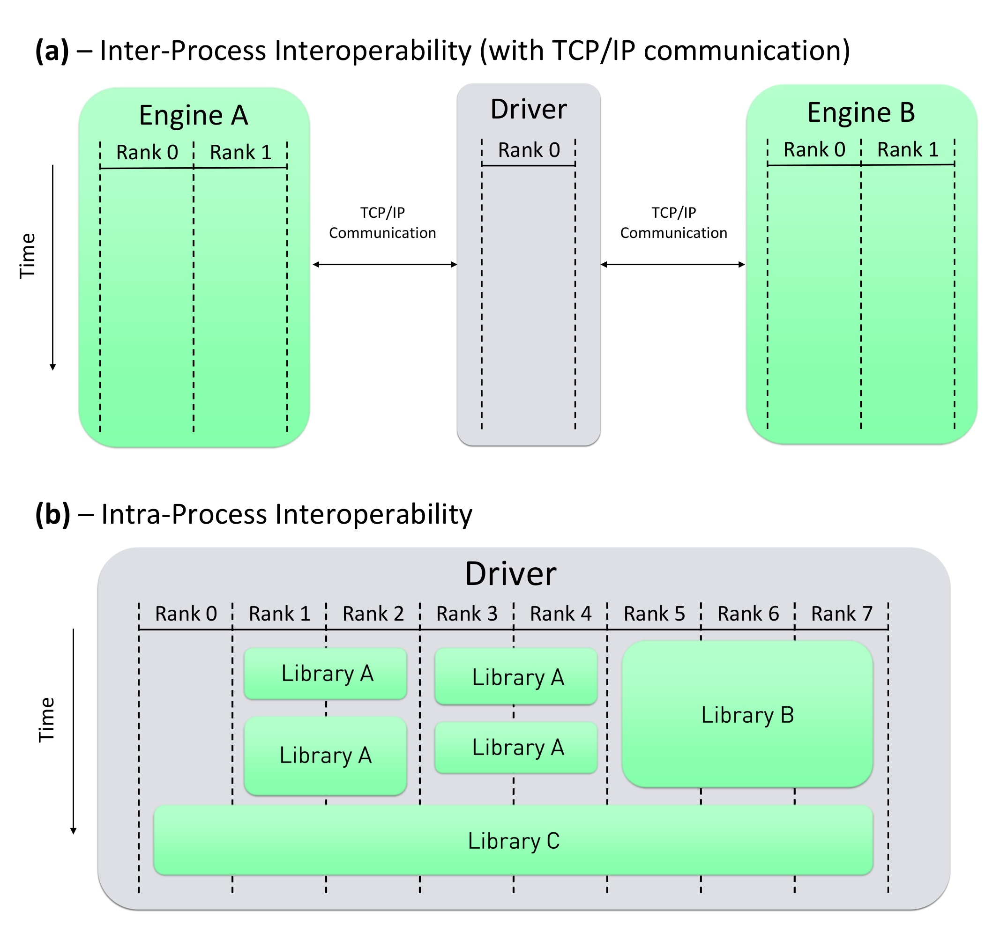
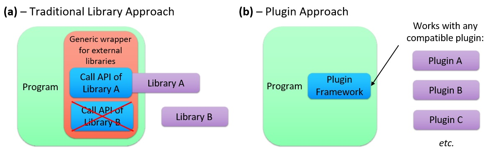

# The MDI Plugin System

In addition to supporting inter-process communication between separately compiled codes, MDI also enables developers to build and utilize MDI engines as highly interoperable plugin libraries.
The MDI Plugin System defines a standardized application programming interface (API) for plugins, so that drivers can be written in a manner that is agnostic with respect to the API of any particular library.
This is highly desirable for situations in which end-users might wish to be able to chose between different libraries that perform similar tasks (for example, different time integration codes, or different codes that perform energy evaluations using quantum mechanics).
Using the MDI Plugin System, developers can support this flexibility without needing to write library-specific code for each library that end-users might wish to use.
Moreover, it is not necessary to explicitly link against MDI plugins during the driver compile process; instead, the MDI Library loads any desired plugins at runtime.
As a result, the choice of which specific plugin(s) should be utilized by a driver can be easily changed without needing to recompile the driver.

## Inter-process vs. Intra-process Interoperability

In the case of TCP/IP-based or MPI-based interoperability, the driver and the engine(s) are executed as separate processes; henceforth, this model of interoperability will be described as "inter-process interoperability".
By contrast, library code is executed by one or more of the same process(es) that execute the calling program; this will henceforth be described as "intra-process interoperability".

<figure>
  
  <figcaption>Figure 1. Illustration of the differences between inter-process and intra-process interoperability.  Part (a) illustrates inter-process interoperability using TCP/IP sockets for communication between codes.  In this particular case, a driver is launched on a single MPI rank (i.e., in serial), while two engines (labeled "Engine A" and "Engine B") are launched on two MPI ranks each.  Communication between the processes is handled via TCP/IP sockets.  Part (b) illustrates intra-process interoperability. 
 In this case, a driver is launched on eight MPI ranks.  At various points during the driver's runtime, one or more of these ranks execute the functions of various libraries (labeled "Library A", "Library B", and "Library C".).</figcaption>
</figure>

Figure 1 illustrates the differences between these two approaches to interoperability.
Whereas the inter-process interoperability paradigm requires that the driver and the engine be executed on separate, simultaneously running computational processes, the intra-process paradigm involves a program and a library that can be executed on the same set of processes.
Moreover, control flow passes between the program's code and the library's code in a sequential manner: when the program calls a library API function, the process(es) that make the call pass control to the library function, and the library function returns control upon completion.
An entire calculation within the intra-process paradigm can thus be performed by a single process that executes the relevant program and library code in a serial manner.
In the case of a parallelized calculation within the intra-process interoperability paradigm, there is considerable flexibility in the way work is distributed between the processes; for example, some processes could be assigned to run library functions, while others might never call any library functions.

The intra-process paradigm offers several potential advantages relative to the inter-process paradigm, including the following:

- **Elimination of communication costs.**
In the case of intra-process interoperability, "communication" with the library's code base may involve only trivially inexpensive memory copy operations associated with passing data to/from the library's functions.

- **More flexible load balancing.**
The inter-process approach requires that the processes running the engine code(s) be executed continuously, so that they can listen for commands from the driver.
This can lead to poor load balancing, as the engines must run even when the driver does not have any work to assign to them.
In the intra-process approach, the library code is only executed by any process(es) that call the library's functions, and ceases to be executed when the function call returns.

- **Simpler end-user launch process.**
In the inter-process approach, it is necessary for the end-user to either launch all of the interoperating codes with separate commands (in the case of TCP-based communication), or launch all of the codes as a single MPMD parallelized calculation (in the case of MPI-based communication).
Both of these scenarios can be more complex than launching a single code that has one or more library dependencies.

One promising approach to mitigating both of the above disadvantages is that of a plugin framework.
Plugins are widely used within the software development community, and provide a mechanism by which the behavior of a program can be extended or modified by a separate plugin code, which can be installed without any need to recompile the program itself.
Within the scientific community, plugin frameworks have been employed in the areas of biodiversity, biophysics, biomedical imaging.
Certain computational chemistry packages, including PySCF and OpenMM, support robust plugin systems, while the PluginPlay project, which is used by NWChemEx, is designed to facilitate the creation of modular computational chemistry plugins.

Plugins typically take the form of shared libraries, which, unlike static libraries, can be dynamically loaded by a program at runtime.
Upon launching, the program will search for any plugins the user has installed, often by either examining a specific directory or by reading a list of installed plugins from a file.
All of the relevant plugins are then dynamically loaded by the program.
A proper plugin framework will define certain parameters by which the program and its plugins may interact.
The framework will typically mandate certain standardized method interfaces that must be defined within each of the plugins for the purpose of initializing and running them, while the program must typically define certain methods that can be executed by the plugins.
Additional details can vary widely between different plugin frameworks.

Plugins offer significant interoperability advantages compared to other types of libraries.
They can be straightforwardly swapped by the end-user at runtime, without requiring that the code be recompiled.
Moreover, it is not necessary for the source code of software that utilizes plugins to explicitly recognize the existence of any particular plugin.
As a result, each of the plugins can be developed and distributed independently from the main software.
This is especially desirable for situations in which a developer wishes to offer end-users the option of selecting between two or more libraries that provide similar functionality.
For example, the developer of a QM/MM driver might wish to grant users a choice between multiple QM or MM libraries.
If each of these libraries implements a different API, the driver's code base must include code that explicitly calls the unique API functions of each library that it supports.
This adds to the workload of the developer, contributes to the technical debt of the code base, complicates the process of compiling the code, and introduces additional work whenever support for another library is desired.
Furthermore, the end-user must ensure that the driver is compiled and configured in a manner that allows it to use whichever specific libraries the end-user prefers; changing this selection may require recompiling the driver.
By contrast, if each of the libraries conform to a consistent plugin framework, the driver can be written in a way that is agnostic to the implementation details of any specific plugin.
Furthermore, the driver does not need to link against any plugins at compile time, and the choice of which specific libraries to use can be deferred until runtime.
Figure 2 illustrates the differences between these two approaches to using libraries.

<figure>
  
  <figcaption>Figure 2. Illustration of the differences between plugins and a more traditional approach to library usage.  Part (a) illustrates a traditional library approach, in which a program can link against either "Library A" or "Library B", which offer similar functionality.  The program's source code must include explicit calls to the API functions of each of the libraries.  For improved code organization, these library-specific calls may be wrapped within a generic wrapper, so that the library API functions are isolated within the wrapper, rather than being scattered throughout the entire code base.  The program's compile process may give the end-user a choice of which library to link against, and changing this selection may require recompiling the code.  In this illustration, the program has been compiled and linked against Library A, but not Library B.  Part (b) illustrates the plugin approach.  In this case, the program implements a plugin framework, and several plugins conform to this framework.  The program does not need to explicitly acknowledge the existence of any specific plugin, and the choice of which plugin is used can be deferred until runtime.</figcaption>
</figure>

## Overview of the MDI Plugin System

The MDI Plugin System implements a standardized, general-purpose plugin framework that operates within an intra-process interoperability paradigm.

The MDI Plugin System is designed to conform to the design goals of the MDI Project as a whole, some of which are highly atypical of the priorities of existing plugin systems.
Pursuit of these goals within the context of plugins introduces several nuanced, low-level computer science challenges that have required the implementation of novel and sophisticated solutions.

The following are among the most notable characteristics of the MDI Plugin System:

- **It is general-purpose.**
Whereas plugin frameworks often are intended for the purpose of allowing a specific program to utilize plugins that are designed for that particular program, the MDI Plugin System enables the creation of plugins that are broadly usable by many different driver programs corresponding to a diverse range of application areas.
Drivers and plugins can straightforwardly interact through the broadly useful set of commands defined by the extensible MDI Standard.
Alternatively, developers in fields far removed from computational chemistry (such as biodiversity or astrophysics) can easily create their own standardized command set and use it within the context of the MDI Plugin System.

- **It uses the MDI Library's existing API.**
The MDI Library provides functions that allow MDI drivers to open MDI-compliant plugins.
Once a plugin has been opened, the driver can interact with the plugin using the same functions that can be used to communicate with external MDI engines (e.g., `MDI_Send_command`, `MDI_Send`, `MDI_Recv`, etc.).
Although the underlying operations performed by these function calls are quite different depending on whether the driver is interacting via TCP/IP sockets, MPI, or through an opened plugin, the MDI Library appropriately handles these distinctions without requiring the developer to be cognizant of them.
For example, when the driver calls `MDI_Recv` (which receives data sent from the engine) in the context of a plugin, the MDI Library merely copies the data returned from the plugin into a buffer that is provided by the driver.
From the perspective of an MDI Driver developer, there is little difference between using an MDI-compliant plugin and using an external MDI engine, and the amount of code reuse that is achievable when supporting both of these use cases is large.
Similarly, developers of MDI engines can typically implement MDI plugin support with relatively little additional effort.

- **It supports cross-language plugins.**
Computational molecular sciences codes are written in a wide variety of different languages, and MDI is designed to support interoperability between codes written in different languages.
The MDI Plugin System allows developers of Fortran, C, and C++ codes to construct MDI-compliant plugins, which can be used by any MDI driver, including drivers written in Python.
In addition, Python scripts that define certain functions required by the MDI Plugin System can be used as MDI plugins.
In this way, it is straightforward for a Fortran code to run a Python code as an MDI plugin, or *vice versa*.

- **It supports the MDI Node System.**
The MDI Node System allows codes to interact at a highly granular level.
For example, when LAMMPS runs as an MDI engine, it is possible for an MDI driver to instruct LAMMPS to run a molecular dynamics simulation, while interacting with LAMMPS at multiple points within each timestep (such as immediately after evaluating the atomic forces, or after updating the positions of the atoms).
This allows the driver to inject modifications to the time integration process being executed by LAMMPS, and is an essential requirement for enabling external drivers to implement techniques like \textit{ab inito} molecular dynamics, metadynamics, QM/MM, etc.
The MDI Plugin System fully supports the MDI Node System.
In this way, the MDI Plugin system facilitates a level of granularity that is characteristic of highly sophisticated library APIs.

The MDI Plugin System offers two different approaches to interacting with plugins.
The first approach is to use the MDI Library to "open" a plugin, in which case the MDI Library will dynamically load the plugin and allow the driver to execute the plugin's functionality using the same set of MDI functions that can be used to interact with external engines.
This approach allows developers to design drivers that are agnostic with respect to the specific plugins they are using, with the choice of which specific plugin to open being made by the end-user at runtime.
Nonetheless, there is one key limitation associated with "opening" MDI plugins: it is not possible to use most of the features of the MDI Node System when interacting with plugins in this manner.
Specifically, such plugins are confined to listening for commands at the `@DEFAULT` node; it is not possible to command them to proceed to any other nodes.
The [Opening Plugins](opening_plugins) page describes this approach in detail.

The second approach is to "launch" plugins.
This approach requires the driver to provide a callback function to the MDI Library, which is executed each time the MDI plugin enters a new node.
By "launching" plugins, drivers can fully utilize the features of the MDI Node System.
The [Launching Plugins](launching_plugins) page describes this approach in detail.

